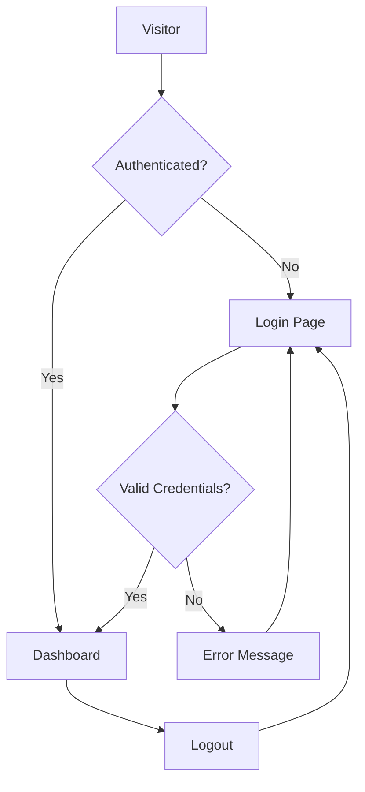

# User Section

This section covers all pages related to user accounts and authentication in CKAN.

## Overview

User pages handle:

- User authentication (login/logout)
- User registration
- Profile management
- API token management
- Password reset
- User activity and dashboard

## Pages in This Section

| Page                                   | Description            |
|----------------------------------------|------------------------|
| [Login](login.md)                      | User login             |
| [Register](new.md)                     | User registration      |
| [User Profile](read.md)                | View user profile      |
| [Edit Profile](edit.md)                | Edit profile           |
| [User Activity](activity.md)           | User activity stream   |
| [Followers](followers.md)              | User followers         |
| [User Organizations](organizations.md) | User's organizations   |
| [User Groups](groups.md)               | User's groups          |
| [API Tokens](api-tokens.md)            | Manage API tokens      |
| [Request Reset](request-reset.md)      | Request password reset |
| [Perform Reset](perform-reset.md)      | Reset password         |
| [User List](list.md)                   | All users              |

## Common Templates

### `_base.html`
Base template for user pages:

```jinja




```

### `_edit_base.html`
Base template for edit pages:
```jinja

```

## URL Structure

```
/user                               # User list
/user/login                         # Login
/user/logout                        # Logout
/user/register                      # Register
/user/{id}                          # User profile
/user/edit                          # Edit profile
/user/activity/{id}                 # Activity stream
/user/followers/{id}                # Followers
/user/{id}/organizations            # User organizations
/user/{id}/groups                   # User groups
/user/{id}/api-tokens               # API tokens
/user/reset                         # Request password reset
/user/reset/{key}                   # Perform password reset
```

## Authentication Flow



## Customization Tips

1. **Login Page**: Customize branding and messaging
2. **Registration**: Add custom fields and validation
3. **Profile**: Enhance with additional user information
4. **API Tokens**: Customize token management interface
5. **Styling**: Apply consistent theming across user pages

## Screenshots

<!-- TODO: Add screenshots of your themed user pages -->

### Login

*Placeholder: Login form with username/password*

### Register

*Placeholder: Registration form*

### User Profile

*Placeholder: User profile page*

### API Tokens

*Placeholder: API token management*

## Related Sections

- [Dashboard](../dashboard/index.md) - User dashboard
- [Organization](../organization/index.md) - User organizations
- [Group](../group/index.md) - User groups
- [Admin](../admin/index.md) - Admin pages
