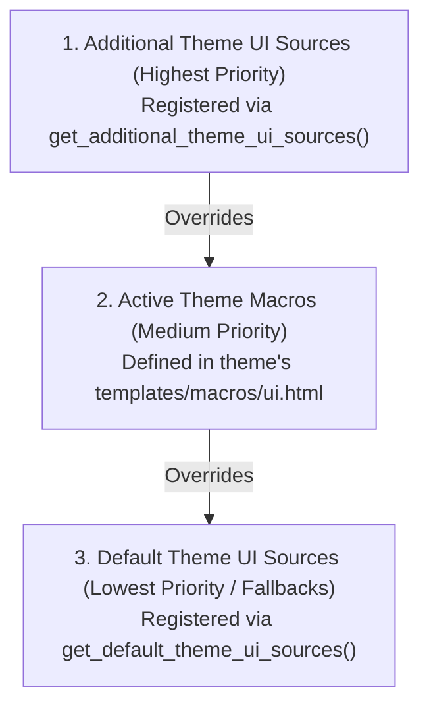

# Customizing components

When maintaining a CKAN portal or building a custom plugin, you often need to
adjust a few UI components to fit organization guidelines, add custom
attributes, or alter markup—without modifying the core theme files or
maintaining a full theme fork.

---

## Component resolution priority

When `ckanext-theming` compiles the available UI components (`ui.*`), it
collects macro definitions from three sources in a strict priority order:



1. **Additional Theme UI Sources** (*Highest Priority*): Macro files registered
   by plugins via `ITheme.get_additional_theme_ui_sources()`. Macros defined
   here override macros from both the active theme and default extension
   sources.
2. **Active Theme Macros** (*Medium Priority*): Macros defined inside the
   active theme's `templates/macros/ui.html`. These override any default
   component implementations provided by extensions.
3. **Default Theme UI Sources** (*Lowest Priority / Fallbacks*): Macro files
   registered by plugins via `ITheme.get_default_theme_ui_sources()`. These
   provide generic fallback implementations that work when a theme does not
   explicitly define a macro.

---

## Adding additional theme sources via interface

To override macros from the active theme or introduce portal-level component
tweaks, implement the `ITheme` interface in your custom plugin and register
your macro file via `get_additional_theme_ui_sources()`.

### Step 1: Implement `ITheme` in `plugin.py`

```python title="plugin.py"
import ckan.plugins as p
from ckanext.theming.interfaces import ITheme


class CustomSitePlugin(ITheme, p.SingletonPlugin):

    def get_additional_theme_ui_sources(self) -> list[str]:
        # Return path to template file relative to template directories
        return ["macros/custom_components.html"]
```

/// note

Ensure that your extension's template directory is registered (e.g. using
`IConfigurer.update_config`) so Jinja2 can locate
`macros/custom_components.html`.

///

### Step 2: Define replacement macros

Create the macro file (e.g., `templates/macros/custom_components.html`) and
define macros with the exact names of the components you wish to replace.

```django title="templates/macros/custom_components.html"
{# Override standard ui.button component #}

    
    
    
        <a {{ ui.util.attrs(kwargs, defaults) }} href="{{ href }}">
            {{ ui.icon("star") }} {{ content }}
        </a>
    
        <button {{ ui.util.attrs(kwargs, defaults) }} type="{{ type }}">
            {{ ui.icon("star") }} {{ content }}
        </button>
    


{# Override standard ui.footer component #}

    
    <footer {{ ui.util.attrs(kwargs, {"class": "site-footer custom-footer"}) }}>
        <div class="container">
            <p>&copy; {{ ui.util.now().year }} {{ site_title or _("My Custom Portal") }}. All rights reserved.</p>
        </div>
    </footer>

```

Because this macro file was added via `get_additional_theme_ui_sources()`,
`ckanext-theming` will register your `button` and `footer` macros with higher
priority than the theme's standard macros. Any template calling `{{
ui.button(...) }}` or `{{ ui.footer(...) }}` will render your customized markup
instead.

---

## Best practices for replacement macros

### Preserve signature interoperability

Always use `kwargs` variable in the macro definition. This informs Jinja2 that
your component accepts arbitrary keyword arguments, preventing runtime errors
when templates pass additional parameters (such as `_extra_class`, `id`,
`data-*`, or `aria-*`). Usually, `kwargs` are naturally used by `ui.util.attrs`
function, to set HTML-attributes on the main component's tag.

```django

    <div {{ ui.util.attrs(kwargs, {"class": "card custom-card"}) }}>
        
            <div class="card-header">{{ title }}</div>
        
        <div class="card-body">{{ content }}</div>
    </div>

```

In case your component has no use of `ui.util.attrs`, add no-op `` line as the first line of macro definition - this line will not cause any
output, but it will inform Jinja2 that macro accepts arbitrary named arguments.

```django

    
    <hr />

```

### Use `ui.util.attrs` for attribute merging

Always use `ui.util.attrs(kwargs, defaults)` to merge your component's default
classes/attributes with any attributes passed in `kwargs`. This preserves
caller customization like `_extra_class`:

```django
{{ ui.button("Click Me", _extra_class="my-brand-glow") }}
```

---

## Inspecting component overrides via CLI

You can verify which macro implementation is active for any component using the CKAN CLI:

```bash
ckan theme component analyze button
```

This command will output details about the active `button` implementation, including its parameters and source path.
